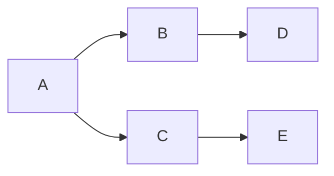

# 泛函分析 8.27 - 第一课 && Preliminaries
## 泛函分析课程信息

- 成绩组成：平时成绩 (30%) + 期末成绩 (70%) ，其中平时成绩的作业部分只需交上即可，对错不影响成绩.
- 教材：讲义

## Questions
### Zorn's Lemma
- 请说明偏序、定向集、全序关系的定义；
- 阐述 Zorn 引理和选择公理.

### Vector Space
- 给出向量空间的定义；
- 说明线性无关、张成以及 Hamel 基的定义；
- 利用 Zorn 引理证明：任何向量空间一定有 Hamel 基.

### Metric Space
- 给出度量、度量空间的定义；
- 说明 Cauchy 列和完备度量空间的定义；
- 给出可分集的定义，并举出可分集和不可分集的例子.

### Topological Space
- 说明拓扑空间的定义并说明为什么度量空间是拓扑空间；
- 给出等价度量的定义；
- 说明相对拓扑的概念；
- 说明定义：
	- 邻域、拓扑基、邻域基；
	- 第一可数集、第二可数集.
- 给出 Hausdorff 空间的定义.
- 说明拓扑空间中连续映射的定义，在某点连续的定义.

### Coverage and Compact Set

- 阐述 Lindelöf 定理.
- 给出紧集的定义和 Heine-Borel 定理的阐述.
- 说明局部紧的定义.

## 符号约定

- 定义域 (domain) ：$\mathcal{D}(f)$ ；
- 集合 $X$ 的幂集 $\mathcal{P}(X)$ ；
- 集合 $U$ 的内部：$\mathrm{int}(U)$ ，外部：$\mathrm{ext}(U)$ ；

## Zorn 引理 (Zorn's Lemma)

以下的部分均为集合论的相关内容，可参考 [计算机集合论笔记](https://www.xzqbear.com/xzqbear-blogs/MATH-%E6%95%B0%E5%AD%A6%E5%9F%BA%E7%A1%80/NKU%20%E8%AE%A1%E7%AE%97%E6%9C%BA%E9%9B%86%E5%90%88%E8%AE%BA%E4%B8%8E%E9%80%BB%E8%BE%91/%E8%AE%A1%E7%AE%97%E6%9C%BA%E9%9B%86%E5%90%88%E8%AE%BA%E4%B8%8E%E9%80%BB%E8%BE%91%E8%AF%BE%E7%A8%8B%E7%AC%94%E8%AE%B0/2.1%20%E4%B8%80%E9%98%B6%E8%AF%AD%E8%A8%80/#_3).

### 偏序与定向集

>[!note] 定义：偏序关系 (partial order)
>设 $\preceq \subset I \times I$ 为二元关系（集合），并记 $x \preceq y$ 当且仅当 $(x,y)\in \preceq$ ，若 $\preceq$ 满足
>
> 1. （自反性）若 $x\preceq x$ ，则 $x=x$ .
> 2. （反对称性）若 $x\preceq y$ 且 $y\preceq x$ ，则 $x=y$ .
> 3. （传递性）若 $x\preceq y$ 且 $y\preceq z$ ，则 $x\preceq z$.
> 
> 则称 $\preceq$ 为**偏序关系**，且用 $(I,\preceq)$ 有序对表示有偏序关系的集合.

>[!note] 定义：定向集 (direct)
>对于偏序集 $(I,\preceq)$ ，若 $\forall x,y\in I$ ，$\exists z\in I$ 使得 $x \preceq z$ 且 $y \preceq z$ ，则称 $(I,\preceq)$ 为**定向集**.

上述定义可以很简单地说：定向集（也称有向集）是每对元素都有上界的偏序集，它保证了上界的存在性.

下面给出偏序关系和定向集的例子：

- 通常的 $\mathbb{R}$ 上的 $\leqslant$ 关系就是一个偏序关系.
- 对于任意的幂集 $\mathcal{P}(X)$ ，$\subseteq$ 就是一个偏序关系.
- **字典序** (lexicographical order)：在 $\mathbb{R}^{2}$ 上定义 $\leqslant$ 为：$(x_{1},y_{1})\leqslant (x_{2},y_{2})$ 当且仅当 $x_{1}\leqslant x_{2}$ 或 $x_{1}=x_{2},y_{1}\leqslant y_{2}$ .
- **函数延拓** (extension)：在函数集 $\mathcal{F}$ 上定义 $\leqslant$ 为：$f \leqslant g$ 当且仅当 $\mathcal{D}(f) \subseteq \mathcal{D}(g)$ 且 $f(x)=g(x),\forall x\in \mathcal{D}(f)$ . $g$ 为函数 $f$ 的延拓.

引入教材 Example 1.1.5 有

>[!faq] 例：教材 Example 1.1.5
>给定 $f\in C[0,1]$ ，定义 $\mathcal{A}$ 为 $[0,1]$ 上的被 $f$ 限制的阶跃函数全体，即 $\varphi(x) = \sum\limits_{i=1}^{n}\alpha_{i}\mathbb{1}_{A_{i}}$ 满足 $\varphi(x) \leqslant f(x),\forall x\in [0,1]$. 我们定义关系 $\preceq$ 为
>$$ \varphi \preceq \psi \iff \varphi(x) \leqslant \psi(x),\forall x\in [0,1] $$
>证明：$(\mathcal{A},\preceq)$ 为定向集.

先证明其为偏序关系：自反性显然，反对称性考虑 $\varphi(x)-\psi(x)$ 恒为 $0$ 即可，传递性由 $\mathbb{R}$ 上 $\leqslant$ 的传递性即证. 我们仅需找到任意函数对的一个上界即可，定义：

$$
(\varphi \lor \psi) (x) = \max \left\lbrace \varphi(x),\psi(x) \right\rbrace
$$

它就是我们所要的上界，故为定向集. $\square$

### 全序关系
接下来给出一组较为简单的定义：我们记 $(X,\preceq)$ 为偏序集，且 $Y \subset X$ .

- 元素 $b\in X$ 称为 $Y$ 的**上界**当且仅当 $\forall y\in Y, y \preceq b$ . 记为 $Y \preceq b$ .
- $Y$ 的上界 $z\in X$ 称为 $Y$ 的**上确界**当且仅当 $Y \preceq b \Rightarrow z\preceq b$ . 记为 $z = \sup{Y}$.
- $z\in Y$ 称为 $Y$ 的**极大值**如果 $\forall a\in Y,z\preceq a \Rightarrow z=a$ .

>[!warning] 极大和最大
>注意此处极大值不能理解为最大值，它们是不一样的概念.

我们可以定义一个如下所示的集合 $S$：

其中 $A\to B$ 表示 $A \preceq B$ （图中省略自己到自己的箭头）. 我们可以证明 $(S,\to)$ 为偏序集，$D$ 和 $E$ 为极大元，但是不是最大元（因为 $D$ 和 $E$ 不能比较）.

>[!note] 定义：全序 (totally order) 和链 (chain)
>$X$ 中的**链**即为 $X$ 的**全序子集** $C \subset X$，全序的含义为：对任意的 $x,y\in C$ ，它们之间可比较，也就是说 $x \preceq y$ 或 $y\preceq x$.

### Zorn 引理与选择公理

>[!note] 定理：Zorn 引理 (Zorn's Lemma)
>如果一个偏序集的每个全序子集都有上界，则它有极大元.

在泛函分析当中我们不讨论其证明和等价性，只需知道它与选择公理等价.

>[!note] 定理：选择公理 (Axiom of Choice)
>给定任意一族非空集合，能同时从每个集合中选出一个元素.

## 线性空间（Vector Space）

这部分内容和高等代数的内容是相似的，不妨回头复习一下线性空间及其子空间的定义，在此不赘述.

但是在高等代数中，我们研究的仅为有限阶的线性空间，在泛函分析中，我们的研究对象将拓广到无穷维，因此相关概念需要一些变动.

首先是线性无关的概念.

>[!note] 定义：线性无关（linearly independent）（无限情形）
>对线性空间 $X$ 的任意子集 $M$ ，若 $M$ 的任意有限子集都是线性无关的，则称 $M$ **线性无关**.

也就是任意有限子集线性无关 $\iff$ 无限集线性无关.

>[!note] 定义：张成的空间 (linear span)
>称线性空间 $X$ 的非空子集 $M$ 中向量的所有线性组合组成的空间为 $M$ 的**张成**，记为
>$$ \mathrm{span}(M) = \left\lbrace \sum\limits_{i=1}^{n}\lambda_{i} v_{i}, \lambda_{i}\in \mathbb{K},v_{i}\in M, 1 \leqslant i \leqslant n,n\in \mathbb{N}  \right\rbrace. $$

有了张成的概念之后，我们可以将有限维的基的概念拓广到无穷维，从而有 Hamel 基的概念.

>[!note] 定义：Hamel 基
>对线性空间 $X$ ，若其非空子集 $B$ 线性无关且 $\mathrm{span}(B) = X$ ，则称 $B$ 为 $X$ 的 **Hamel 基**（也称为**基**）.

Hamel 基的存在性可用 Zorn 引理进行证明. 

## 度量空间 (Metric Space)
### 度量空间

>[!note] 定义：度量空间 (metric space)
>定义有序对 $(X,d)$ 为**度量空间**，其中 $X$ 为集合，$d:X\times X \mapsto \mathbb{R}^{+}$ 为满足条件的二元函数：
>
> 1. $d$ 是一个非负有限实值二元函数；
> 2. $d(x,y)=0 \iff x=y$ ；
> 3. （对称性, symmetry）$d(x,y) = d(y,x)$ ；
> 4. （三角不等式, triangle inequality） $d(x,z) \leqslant d(x,y)+ d(y,z),\forall x,y,z\in X$.
> 
> $d$ 称为该度量空间当中的**度量** (metric)，若 $d$ 不满足上述的 2 ，则称为**伪度量** (pseudometric).

本章的基本内容在老师上课的时候跳过要求自学了. 但是作业里面有一道度量空间的问题.

在实际例子当中，只需要验证 $(X,d)$ 当中的 $d$ 满足上述的四个条件即可. 事实上，难度基本集中于证明三角不等式的部分，它在一些相对抽象的度量空间中并没有那么好证明.

给出几个度量空间的例子：

- 离散度量

离散度量即对任意的非空集合 $X$ ，定义度量为

$$
d(x,y) = 
\begin{cases}
0, & x=y \\
1, & x\neq y
\end{cases}
$$

容易验证上述 $d$ 是一个度量.

- 连续函数空间 $C[a,b]$ 的度量

定义度量空间为 $(C[a,b],d)$ ，其中 $d$ 定义为

$$
d(x,y) = \max_{t\in [a,b]}|x(t)-y(t)|
$$

容易验证 $d$ 为度量.

### 度量空间中的拓扑

定义度量之后，我们可以定义球和球面：开球 $B(x_{0},r)$ 记为

$$
B(x_{0},r):= \left\lbrace x\in X : d(x,x_{0}) < r \right\rbrace
$$

闭球 $\overline{B}(x_{0},r)$ 即将上述的 $<$ 改为 $\leqslant$ . 球面 $S(x_{0},r)$ 将上述 $<$ 改为 $=$ 即可.

接下来，我们继承在 $\mathbb{R}^{n}$ 中已经学过的开集和闭集的概念，**开集** $M$ 即满足任意 $x\in M$ 都存在 $r$ 使得 $B(x,r) \subset M$ . **闭集**即定义为开集的补集.

邻域、内部、外部、闭包、极限点、孤立点在实变当中都已学过，在此不进行说明.

>[!note] 定义：可分集 (separable)
>称一个集合 $X$ 是**可分的**，若 $X$ 存在可数的稠密子集.

例如，$\mathbb{R}^{n}$ 都是可分的，因为 $\mathbb{Q}^{n}$ 是可数的稠密子集. 

### Cauchy 列与完备度量空间

>[!note] 定义：收敛 (converge)
>度量空间中的点列 $\left\lbrace x_{n} \right\rbrace$ 收敛于 $x_{0}$ 即为
>$$ \lim_{n\to \infty} d(x_{n},x_{0}) = 0. $$

>[!note] 定义：Cauchy 列
>若对于点列 $\left\lbrace x_{n} \right\rbrace$ ，对任意的 $\varepsilon>0$ ，存在 $N\in \mathbb{N}$ 使得
>$$ d(x_{n},x_{m}) < \varepsilon, \forall m,n >N $$
>则称该点列为 **Cauchy 列**.

需要说明的是，一般的度量空间下，Cauchy 列和收敛列并不一定等价，也就是说 Cauchy 收敛准则不能推广到一般的度量空间当中去. 因此引入完备度量空间的概念.

>[!note] 定义：完备度量空间 (complete metric space)
>称度量空间 $(X,d)$ 是**完备** (complete) 的，如果其中的每个 Cauchy 列都收敛.

## 拓扑空间 (Topological Space)
### 拓扑空间的定义

>[!note] 定义：拓扑空间 (Topological Space)
>给定集合 $X$ 和一个**开集族** $\mathscr{T}$ ，若 $\mathscr{T}$ 满足以下三条性质，则称 $(X,\mathscr{T})$ 为**拓扑空间**. 且 $\mathscr{T}$ 为**拓扑**.
>1. $\varnothing,X\in \mathscr{T}$.
>2. 若 $X_{1},X_{2}\in \mathscr{T}$ 则 $X_{1}\cap X_{2}\in \mathscr{T}$. （即开集的有限交仍为开集）
>3. 若 $X_\lambda\in \mathscr{T},\forall \lambda\in \Lambda$ ，则 $\bigcup_{\lambda\in \Lambda}X_{\lambda} \in \mathscr{T}$. （即开集的任意并仍为开集）

对于两个拓扑 $\mathscr{T}_{1}$ 和 $\mathscr{T}_{2}$ ，如果 $\mathscr{T}_{1}\subseteq \mathscr{T}_{2}$ ，则称 $\mathscr{T}_{1}$ 作为拓扑**粗于** (coarser) $\mathscr{T}_{2}$ ，也称 $\mathscr{T}_{2}$ **细于** (finer) $\mathscr{T}_{1}$ .

### 等价度量与度量诱导的拓扑

在度量空间 $(X,d)$ 给定的情况下，我们可以定义出如下的几个集合：

- 开球：$B(x_0,r) = \left\lbrace x| d(x,x_{0}) < r \right\rbrace$ .
- 闭球：$\widetilde{B}(x_{0},r) = \left\lbrace x| d(x,x_{0}) \leqslant r \right\rbrace$ .
- 球面：$S(x_{0},r) = \left\lbrace x| d(x,x_{0}) = r \right\rbrace$ .

将 $\varnothing,X$ 和开球全体以及它们的有限交、任意并产生的集合统一放入 $\mathscr{T}$ ，则 $(X,\mathscr{T})$ 就构成了一个拓扑空间，$\mathscr{T}$ 称为由 $d$ 度量**诱导的拓扑**.

此外，还可引入等价度量的概念.

>[!note] 定义：等价度量（equivalent metrics）
>对于度量空间 $(X,d_{1}),(X,d_{2})$ ，若存在 $\alpha,\beta>0$ 使得对于任意的 $x,y\in X$ ，有
>$$ \alpha d_{1}(x,y) \leqslant d_{2}(x,y) \leqslant \beta d_{1}(x,y),\forall x,y\in X $$
>则称 $d_{1},d_{2}$ 为**等价度量**.

等价度量诱导的拓扑是一致的.

### 拓扑子空间与相对拓扑

对于 $Y \subseteq X$ ，其中 $X$ 为拓扑空间时，$Y$ 作为子空间，若它是拓扑空间，则其中的 $U \subseteq Y$ 称为**开集**（或**相对开集**），如果存在 $X$ 中的开集 $O$ 使得 $U = O\cap Y$ .

- 一个例子：$(0,1]$ 不是 $\mathbb{R}$ 中的开集，但是 $[0,1]$ 中的相对开集，因为存在 $(0,2)$ 使得 $(0,1] = [0,1]\cap (0,2)$ .

通过这种方式诱导出来的拓扑称为**相对拓扑**或 $Y$ **诱导的拓扑**，即

$$
\mathscr{T}\cap Y := \left\lbrace O\cap Y: O\in \mathscr{T} \right\rbrace
$$

## 邻域基、可数性
### 邻域、邻域基

>[!note] 定义：邻域 (neighborhood)
>对于拓扑空间 $(X,\mathscr{T})$，对 $x\in X$ 和 $V \subseteq X$ ，若存在开集 $U \subseteq V$ 使得 $x\in U$ ，则称 $V$ 为 $x$ 的**邻域**.

拓扑空间中的邻域有可能较大，也有可能较小，易知 $X$ 就是 $x$ 的一个开邻域.

>[!note] 定义：拓扑基 (base)
>给定拓扑空间 $(X,\mathscr{T})$ ，对开集族 $\mathfrak{B} \subseteq \mathscr{T}$ ，若对于任意 $x\in X$ 以及 $x$ 对应的每个邻域 $U$ ，都存在 $O \in \mathfrak{B}$ 使得
>$$ x\in O \subseteq U $$
>则称 $\mathfrak{B}$ 为拓扑 $\mathscr{T}$ 下的**拓扑基**.

>[!note] 定义：邻域基 (neighborhood base)
>给定拓扑空间 $(X,\mathscr{T})$ 与点 $x\in X$ ，对 $x$ 的邻域族 $\mathfrak{B}_{x}$ ，若对于 $x$ 的每个邻域 $U$ ，都存在 $B\in \mathfrak{B}_{x}$ ，使得
>$$ x\in B \subseteq U $$
>则称 $\mathfrak{B}_{x}$ 为 $x$ 的**邻域基**.

注意，邻域基不需要其中的集合是开集，这是由于邻域不需要是开集.

### 第一可数、第二可数

>[!note] 定义：第一可数、第二可数 (first countable, second countable)
>若拓扑空间 $X$ 中的每个 $x$ 都有可数的邻域基，则称 $X$ **是第一可数的**；若对 $X$ 的拓扑有可数的拓扑基，则称 $X$ 是**第二可数**的.

>[!faq] 例：度量空间的可数性
>证明：任意度量空间均为第一可数的.

给定度量空间 $(X,d)$ ，对任意的 $x$ ，考虑如下的集族：

$$
\mathfrak{B}_{x}= \left\lbrace B\left(x,\frac{1}{n}\right): n\in \mathbb{N} \right\rbrace
$$

则上述的集族为 $x$ 的邻域基，故 $(X,d)$ 为第一可数的. $\square$

>[!faq] 例：实数集的可数性
>证明：$\mathbb{R}$ 是第二可数的.

取所有的有理数列为 $\left\lbrace r_{n} \right\rbrace$，引入欧氏度量并取如下的拓扑基：

$$
B\left(r_{n},\frac{1}{m}\right) = \left\lbrace x: |x-r_{n}| < \frac{1}{m} \right\rbrace
$$

取遍所有的 $n\in \mathbb{N}$ 以及 $m\in \mathbb{N}$ ，则对于任意的 $x\in \mathbb{R}$ ，若 $x\in \mathbb{Q}$ ，则对于任意 $x$ 的邻域 $U$，总可以取到足够小的 $m$ 使得 $B\left(x,\frac{1}{m}\right) \subseteq U$ .

对 $x\in \mathbb{R}\setminus \mathbb{Q}$ ，对于 $x$ 的任意邻域，在其中总有有理数，因此可以利用有理数的取法进行说明. $\square$

## Hausdorff 空间

>[!note] 定义：Hausdorff 空间 (Hausdorff Space)
>一个拓扑空间 $(X,\mathscr{T})$ 称为 **Hausdorff 空间**，如果对于任意两个互异的点 $x,y\in X$ ，对应存在两个**不交的邻域** $U_{x},U_{y}$.

>[!faq] 例：度量空间具有 Hausdorff 性
>证明任意的度量空间均是 Hausdorff 空间.

对 $(X,d)$ ，有互异两点 $x,y\in X$ ，设 $d(x,y) = r$ ，则取两个邻域为

$$
U_{x} = B\left(x, \frac{1}{3}r\right), U_{y} = B\left(y, \frac{1}{3}r\right)
$$

则 $U_{x}\cap U_{y} = \varnothing$ ，故度量空间是 Hausdorff 空间. $\square$

## 连续映射

>[!note] 定义：拓扑空间的连续映射
>设 $X,Y$ 均为拓扑空间，映射 $T:X\mapsto Y$ 在 $x\in X$ 处连续当且仅当对 $Tx\in Y$ 的每个邻域 $U$ ，都存在 $V\subseteq X$ 使得
>$$ TV \subseteq U $$

## 覆盖与紧集
### Lindelöf 性质

>[!note] 定理：Lindelöf 定理
>若 $X$ 是第二可数的，则 $X$ 的任意开覆盖都有**可数子覆盖**.

易知 $\mathbb{R}$ 是 Lindelöf 的.

### 紧集与 Heine-Borel 定理

>[!note] 定义：紧集 (compact)
>若 $X$ 的任意开覆盖都有有限子覆盖，则称 $X$ 是**紧集**. 若 $\overline{X}$ 是紧集，则称 $X$ **相对紧致**.

>[!note] 定理：Heine-Borel 定理
>$\mathbb{K}^{n}$ 中的紧集和有界闭集等价.

### 紧集的性质

- $X$ 是紧集当且仅当其具有**有限交性质**：即一族闭集的交是非空的，如果它的任意有限子集族都是非空的.
- 紧集在连续映射下的像也是紧的.
- 紧集的闭子集一定紧.
- 紧集的有限并一定紧.
- 紧集的有限卡氏积一定紧.
- 若 $X$ 是 Hausdorff 空间，则
	- 其中的每个紧集都是闭集.
	- 其中紧集的任意交都是紧集.

### 局部紧

>[!note] 定义：局部紧 (locally compact)
>一个拓扑空间 $X$ 称为**局部紧**的，如果其中的每个点 $x$ 都有紧邻域.

## 作业
- P12: T3, T4

