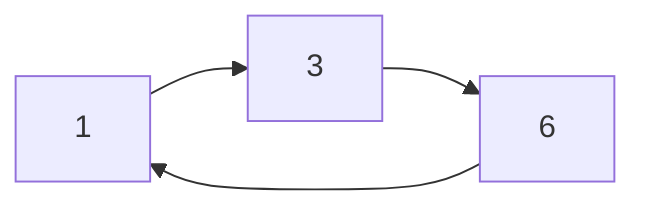

# 排列常用的表示方式
## 排列
令 $S$ 是一个包含 $n$ 个元素的集合，通常令

$$
S = \left\lbrace 1,2,\cdots,n \right\rbrace
$$  

$S$ 上的一个排列 (permutation) 是将 $1,2,\cdots,n$ 按顺序排成一列，可记作：

$$
\pi = \pi_1 \pi_2 \cdots \pi_3 
$$

令所有的排列构成的集合为 $S_n$ ，那么此时有 $|S_n| = n!$ . 

----

排列可看作一个双射，例如对于 $1234$ 的一个排列：

$$
\pi : 3124
$$

此时 $\pi$ 为双射，例如 $\pi(1) = 3$ 等等.

每个排列还可看作一个矩阵，上面的 $\pi$ 就可以写为如下的矩阵：

$$
\begin{pmatrix}0 & 0 & 1 & 0 \\ 1 & 0 & 0 & 0 \\ 0 & 1 & 0 & 0 \\ 0 & 0 & 0 & 1\end{pmatrix}
$$

一般称为**排列矩阵**.

## 拓展：双随机矩阵
设矩阵 $M = (m_{ij})$ 满足：

1. $m_{ij}$ 为非负实数；
2. 每行每列的和为 $1$ .

此时称矩阵 $M$ 为**双随机矩阵**.

例如二维矩阵：

$$
\begin{pmatrix}1-a & a \\ a & 1-a\end{pmatrix},0<a<1
$$

此时有下面的结论：
>[!note] 定理：双随机矩阵和排列矩阵的关系
>所有 $n\times n$ 双随机矩阵可看作 $\mathbb{R}^{n^2}$ 中的一个点，一个经典的结论是：
>所有 $n\times n$ 双随机矩阵构成 $\mathbb{R}^{n^2}$ 的一个凸多面体，其顶点恰为所有 $n$ 维排列矩阵.

利用二维矩阵来作为一个典型的例子：

$$
\begin{pmatrix}1-a & a \\ a & 1-a\end{pmatrix} = (1-a)\begin{pmatrix}1 & 0 \\ 0 & 1\end{pmatrix} + a \begin{pmatrix}0 & 1  \\ 1 & 0\end{pmatrix}
$$

## 排列的圈表示
这个部分和抽象代数中的排列表示方式是一致的，例如，对于置换 $(1\ 3\ 6)$ :

在离散结构及其算法中称为**圈表示**.

和抽象代数类似，所有的排列都可以写为**圈表示**的乘积，例如, $\pi = 6517234$ 可以表示为：

$$
\pi = (1\ 3\ 6)(4\ 7)(2\ 5)
$$

与抽象代数不同的是，此时我们要关心的是圈的个数，因而有定义：
>[!note] 定义：第一类 Stirling 数
>$S_n$ 中具有 $k$ 个圈的排列的个数称作（无符号）的**第一类 Stirling 数** ，记为 $c(n,k)$ ：
> $$ c(n,k) = \big|\left\lbrace \pi\in S_n| \pi \text{的圈表示恰有} n \text{个圈}  \right\rbrace \big|$$ 

例如，对于 $n=3$ ，我们有

$$
123 = (1)(2)(3)
$$

$n=3$ 的情形只有这个情况是 $3$ 个圈，从而 $c(3,3) = 1$ .

需要注意的是它和组合数并不是一个东西，例如 $\mathrm{C}_3^1=3$ 但是 $c(3,1)=2$ .

如何计算第一类 Stirling 数是一个自然产生的问题，这也启发我们去思考有没有潜在的递推关系. 事实上，有如下的递推关系：

>[!note] 定理：第一类 Stirling 数的递推关系
>$$ c(n,k) = (n-1)c(n-1,k)+ c(n-1,k-1) $$

证明：
考虑 $n-1$ 的情形，由于 $n$ 的情形只多了一个元素，我们只需要考虑两种情形：
(1) 如果恰好有 $k-1$ 个圈，此时我们只能多加一个圈，这个圈也仅能是 $(n)$ ，因此这部分对应 $c(n-1,k-1)$ .
(2) 如果恰好有 $k$ 个圈，此时需要将 $n$ 塞入其中某个圈当中，即

$$
\pi = (\cdot)(\cdot )\cdots(\cdot)
$$

从中选取一个，而对于长度为 $m$ 的一个圈，共有 $m$ 种加入方法（两数间的空隙，而第一个和最后一个空隙等价），因此共有 $n-1$ 中加入方法，对应 $(n-1)c(n-1,k)$ .

根据加法原理将两种方案相加即可. $\square$

## “生成函数”
我们现在考虑一个更简单的观察 $c(n,k)$ 的方法，我们不妨先看 $n=3$ 的情况：

$$
c(3,3) = 1, c(3,2) = 3,c(3,1) = 2
$$

此时我们将其写为和式 $\sum\limits_{k=1}^n c(n,k) x^k$ 的形式：

$$
x^3+3x^2+2x =(x+2)(x+1)x
$$

如果考虑 $n=2$ 的情况也是类似的：

$$
x^2+x = (x+1)x
$$

因此可以猜想：
>[!note] 定理：“生成函数”
> $$ \sum\limits_{k=1}^n c(n,k)x^k = (x+n-1)(x+n-2)\cdots(x+1)x $$

利用数学归纳法，考虑设

$$
F(n) = (x+n-1)(x+n-2)\cdots (x+1)x = \sum\limits_{k=1}^nb(n,k)x^k
$$

此时有

$$
\begin{aligned}
F(n) &= (x+n-1)F(n-1) \\
&= (x+n-1)\sum\limits_{k=1}^{n-1} b(n-1,k)x^k \\
&= \sum\limits_{k=1}^{n-1} b(n-1,k)x^{k+1} +(n-1)\sum\limits_{k=1}^{n-1} b(n-1,k)x^k
\end{aligned}
$$

因此系数满足：

$$
b(n,k) = (n-1)b(n-1,k)+b(n-1,k-1)
$$

这个递推公式和 $c(n,k)$ 递推公式一致，且初值也一致，那它们就是一致的. $\square$

